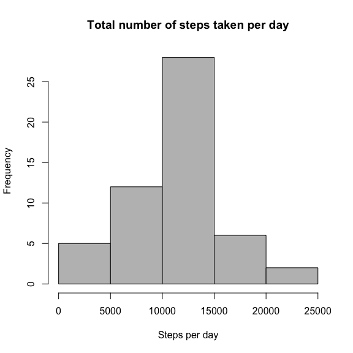
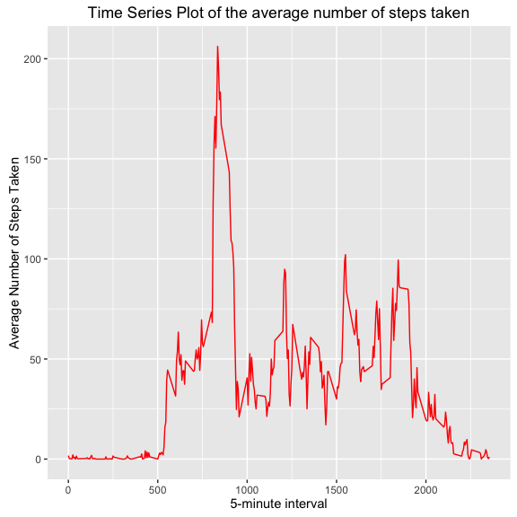
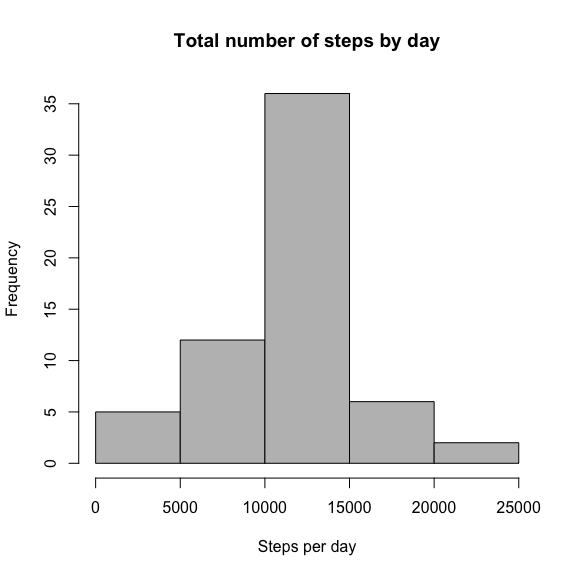
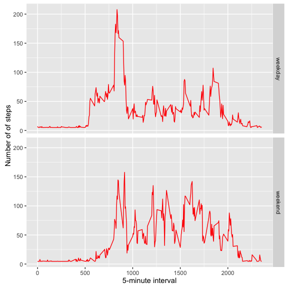

# Reproducible Research: Peer Assessment 1
`r Sys.Date()`  
****
This document is intended to perform all the steps needed to successfully complete the Course Project 1. 


### Loading and preprocessing the data


```r
##Load libraries
library(ggplot2)
library(dplyr)
library(Hmisc)

##Load and unzip dataset 
unzip(zipfile = "activity.zip")
data <- read.csv("activity.csv")
```

### What is mean total number of steps taken per day?

1. Histogram of the total number of steps taken each day


```r
totalsteps <- aggregate(steps ~ date, data=data, sum, na.rm = TRUE)
hist(totalsteps$steps, main="Total number of steps taken per day", xlab="Steps per day", col="grey")
```

 

2. Mean and median of the total number of steps taken per day

* *Mean value*

```r
meansteps <- mean(totalsteps$steps)
print(meansteps)
```

```
## [1] 10766.19
```

* *Median value*

```r
mediansteps <- median(totalsteps$steps)
print(mediansteps)
```

```
## [1] 10765
```

### What is the average daily activity pattern?

1. Time series plot

```r
timeseries <- aggregate(steps ~ interval, data=data, mean, na.rm = TRUE)
ggplot(timeseries, aes(interval, steps)) + 
        geom_line(color = "red", size = 0.5) + 
        labs(title="Time Series Plot of the average number of steps taken",
              x="5-minute interval", y="Average Number of Steps Taken")
```

 

2. 5-minute interval which contains the maximum number of steps

```r
timeseries$interval[which.max(timeseries$steps)]
```

```
## [1] 835
```

### Imputing missing values
1. Calculate and report the total number of missing values in the dataset


```r
sum(!complete.cases(data))
```

```
## [1] 2304
```

2-3. Strategy for filling in all of the missing values in the dataset and create new dataset equal to the original but with the missing data filled in


```r
##Using "impute" function from library Hmisc and the mean for that day
##for filling in all missing values
dataimput <- data
dataimput$steps <- impute(data$steps, fun=mean)
```

4. Histogram of the total number of steps taken each day. Mean and median total number of steps taken per day


```r
averageimputed <- aggregate(steps ~ date, data=dataimput, sum)
hist(averageimputed$steps, main = "Total number of steps by day", xlab = "Steps per day", col = "grey")
```

 

* *Mean value*

```r
meanimput <- mean(averageimputed$steps)
print(meanimput)
```

```
## [1] 10766.19
```

* *Median value*

```r
medianimput <- median(averageimputed$steps)
print(medianimput)
```

```
## [1] 10766.19
```

The value for the mean is exactly the same as in the first part of the assignment; in the case of the median the are roughly similar. In general terms, the imputation of the missing values does not seem to have a major effect on the estimation of the total daily number of steps.

### Are there differences in activity patterns between weekdays and weekends?

1. New factor variable in the dataset with two levels: “weekday” and “weekend”


```r
dataimput <- mutate(dataimput, weekday=factor(weekdays(as.Date(dataimput$date))))
levels(dataimput$weekday) <- list(weekday = c("Monday", "Tuesday",
                                               "Wednesday", "Thursday","Friday"),
                                  weekend = c("Saturday", "Sunday"))
levels(dataimput$weekday)
```

```
## [1] "weekday" "weekend"
```

2. Time series plot of the 5-minute interval and the average number of steps taken, averaged across all weekday days or weekend days


```r
averages <- aggregate(steps ~ interval + weekday, data=dataimput, mean)
ggplot(averages, aes(interval, steps)) + 
        geom_line(color = "red", size = 0.5) + facet_grid(weekday ~ .) + 
        xlab("5-minute interval") + ylab("Number of of steps")
```

 

